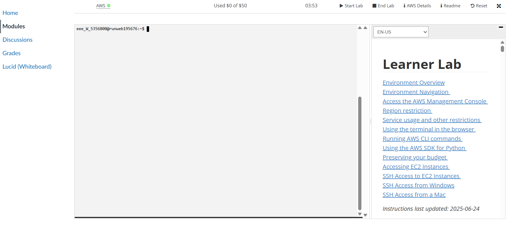
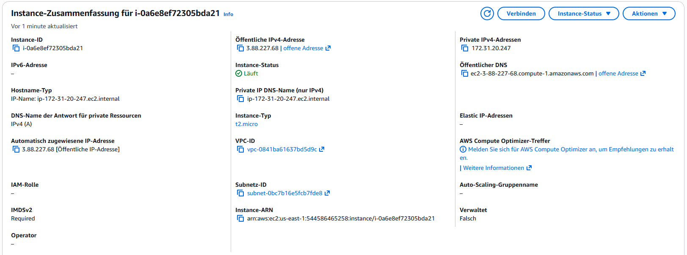
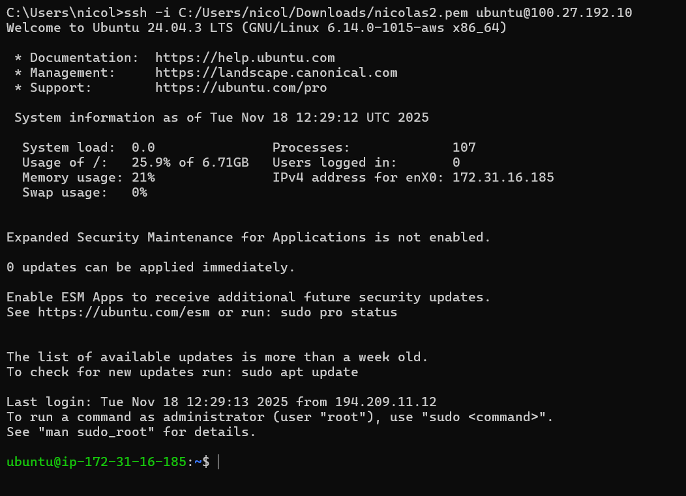
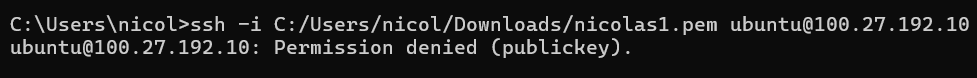
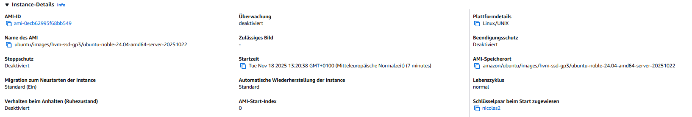

# KN02-AWS Aufgabe

---

## A) Umgang mit AWS Kurs (20%)

---

## B) Instanz erstellen (40%)

### Details zur Instanz

- **Anzahl der vCPUs:** 1
- **Betriebssystem:** Ubuntu Server 24.04 LTS (64-Bit)
- **Diskgrösse:** 8 GiB
- **RAM:** 1 GiB

---

## C) Zugriff mit SSH-Key (40%)

### 1. Verbindung mit dem richtigen Private Key

### 2. Verbindung mit falschem Private Key

### 3. Instanz-Details (sichtbares Schlüsselpaar)

