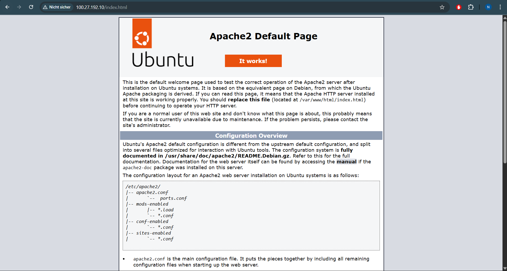
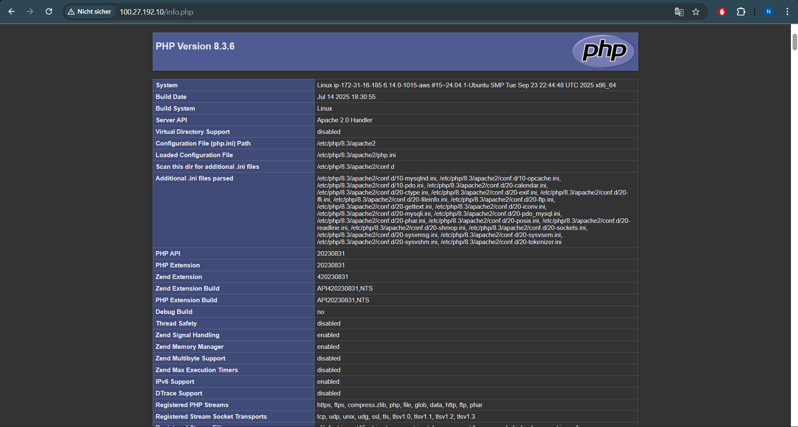
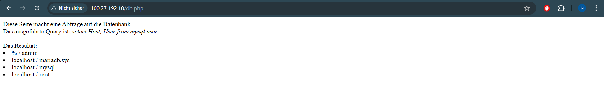
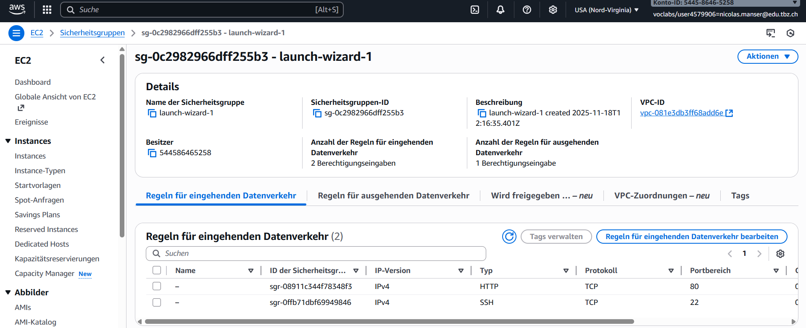
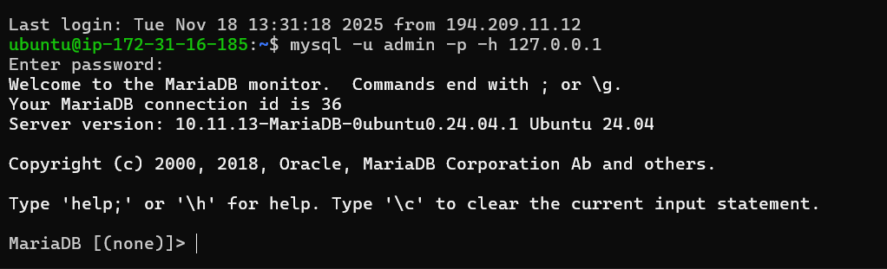

# Übersicht der Server-Konfiguration

---

## 1. Websiten





---

## 2. Öffentliche IP der Instanz


---

## 3. Sicherheitsgruppen-Regeln



## 4. MySQL-Zugang



```bash
mysql -u admin -p -h <127.0.0.1>
```

## 5. SELECT-Statement

Ein SELECT-Statement wird in SQL verwendet, um Daten aus einer Tabelle abzufragen. Damit kann man bestimmte Spalten oder alle Einträge anzeigen lassen, z. B. SELECT user, host FROM user; zeigt alle Benutzer mit den erlaubten Hosts aus der Tabelle user an.
