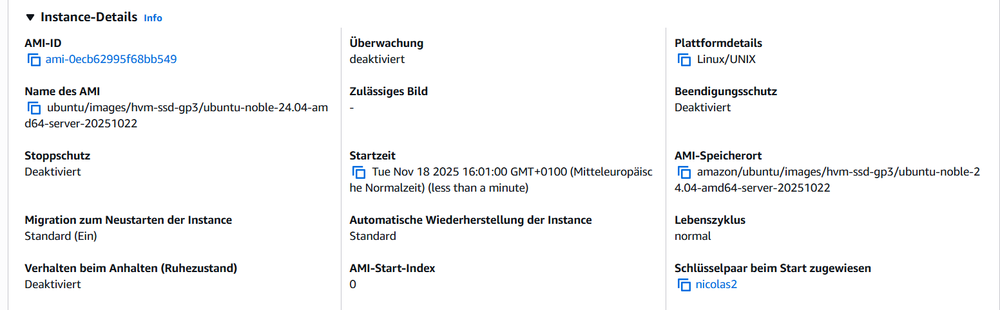
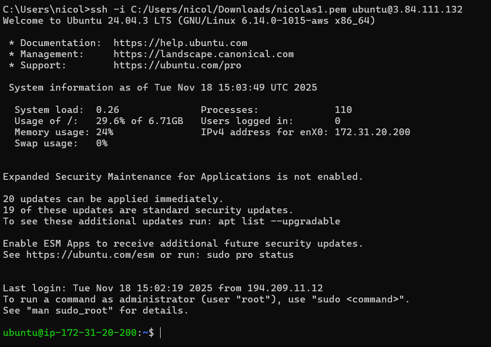
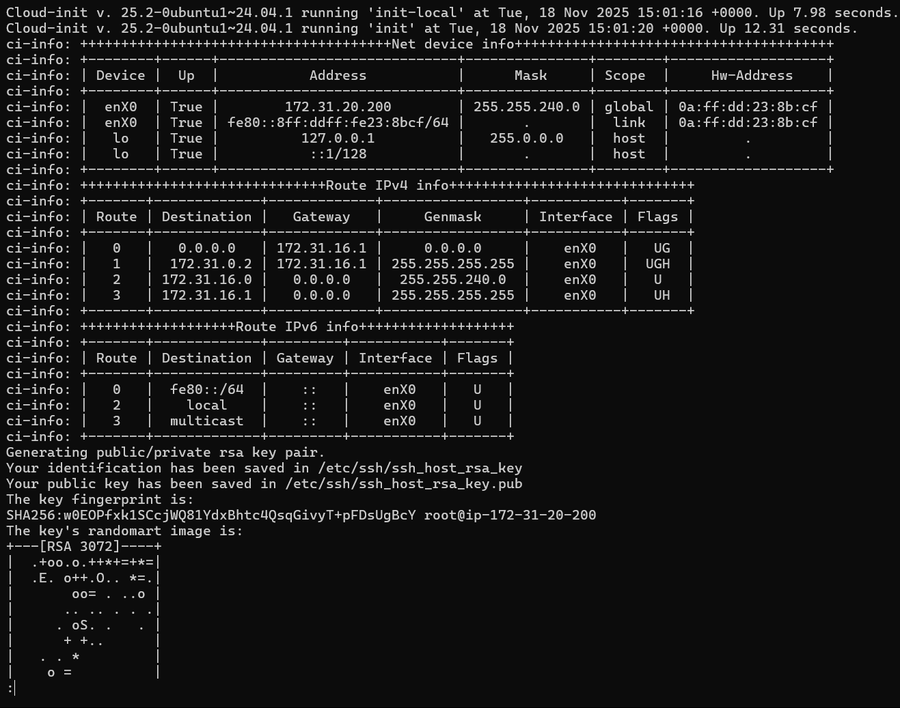
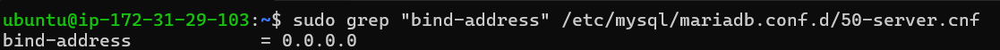
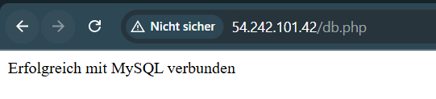
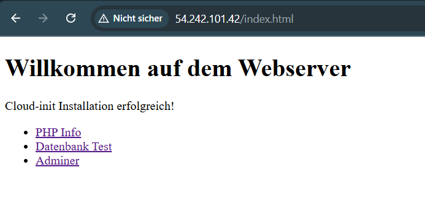
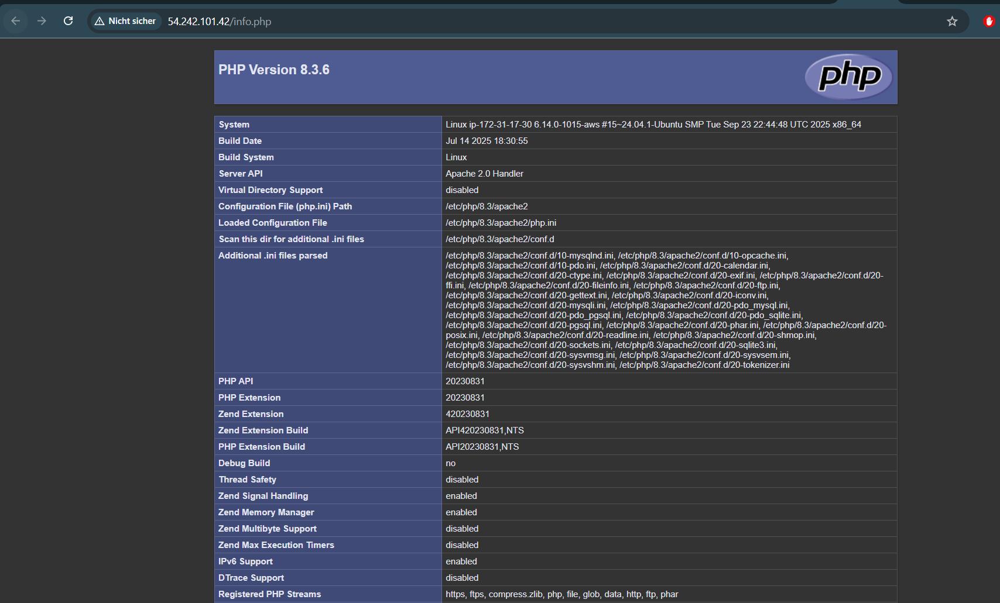
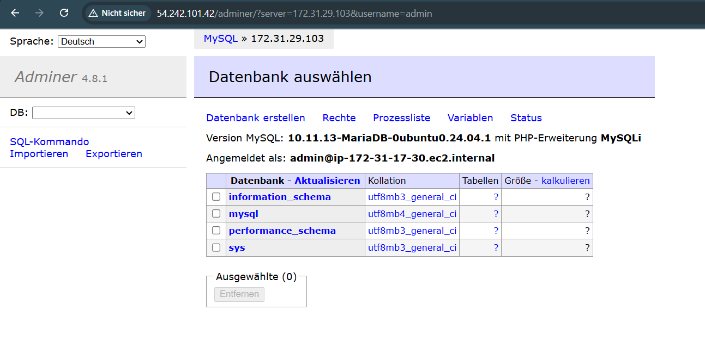

# Cloud-Init und SSH-Key Aufgabe

## A) Cloud-init Datei verstehen (10%)

Die YAML-Datei befindet sich im YAML-Ordner.

## B) SSH-Key und Cloud-init (15%)

### 1. Angepasste YAML

Die angepasste YAML-Datei finden Sie im YAML-Ordner.
Der öffentliche SSH-Key wurde für die Cloud-Init Konfiguration angepasst.

### 2. Details der Instanz



### 3. SSH-Befehl mit dem ersten Schlüssel (funktioniert)



### 4. SSH-Befehl mit dem zweiten Schlüssel (funktioniert nicht)


### 5. Cloud-Init Log



```bash
sudo less /var/log/cloud-init-output.log
```

## D) Installation automatisieren (70%)

### Datenbank



Der Befehl zum Anzeigen:

```bash
sudo grep "bind-address" /etc/mysql/mariadb.conf.d/50-server.cnf
```

### Webserver

db.php


index.html


info.php


Admin Login DB

