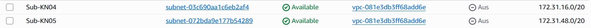
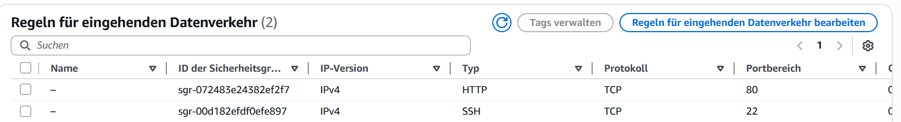
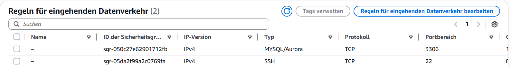
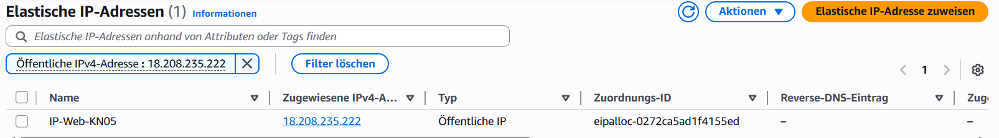
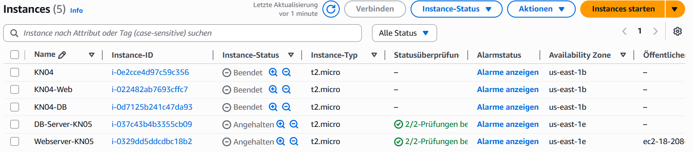
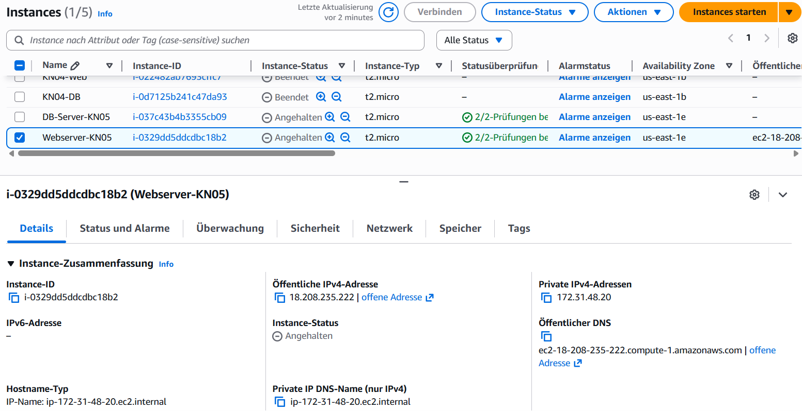
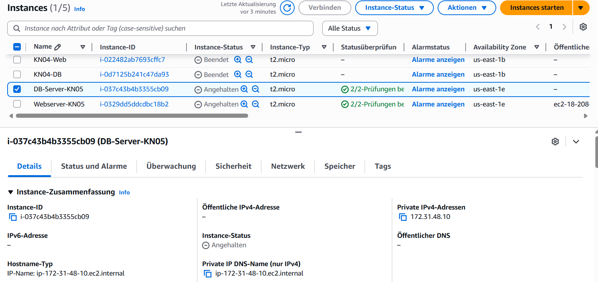
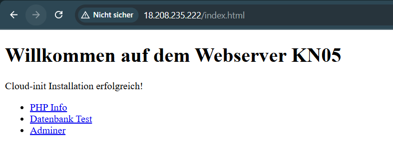
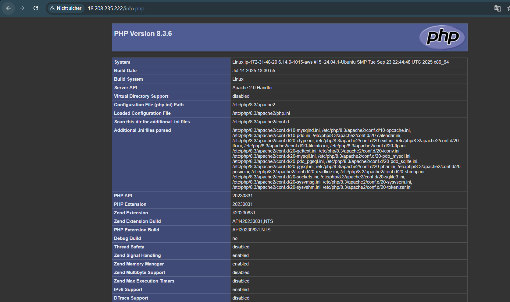
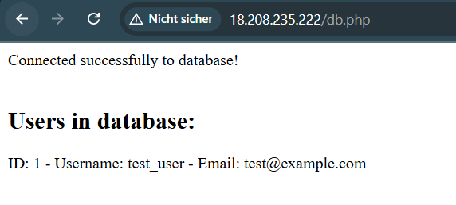

# KN05: Netzwerk / Sicherheit

## A) Grundbegriffe und private IP wählen (30%)

### VPC

Eine **VPC (Virtual Private Cloud)** ist ein eigenes privates Netzwerk in der Cloud. Darin werden alle Komponenten eines Projekts aufgebaut, z. B. Server, Datenbanken und andere Dienste.

### Subnet

Ein **Subnet** ist eine Unterteilung der VPC. Damit wird festgelegt, welche Server in welchem Teil des Netzwerks stehen und mit welchen anderen Geräten sie kommunizieren dürfen.

### Public IP

Eine **Public IP** ist eine öffentliche IP-Adresse, über die Geräte oder Server direkt aus dem Internet erreichbar sind.

### Private IP

Eine **Private IP** wird innerhalb eines lokalen Netzwerks verwendet. Geräte mit einer privaten IP können nur innerhalb desselben Netzwerks kommunizieren, was die Sicherheit erhöht, da sie nicht direkt aus dem Internet erreichbar sind.

### Statische IP

Bei einer **statischen IP** wird die Adresse manuell festgelegt und ändert sich nicht automatisch. Im Gegensatz dazu wird einer **dynamischen IP** die Adresse automatisch vom Netzwerk (z. B. vom Router) zugewiesen.  
Eine statische IP ermöglicht, dass ein Gerät immer unter derselben Adresse erreichbar ist.

### Subnet Name ändern

### Beispiel private IPs

- Web: `172.31.48.20`
- DB: `172.31.48.10`

---

## B) Objekte und Instanzen erstellen (70%)

### Sicherheitsgruppen

#### Webserver

**Eingehende Regeln**

#### Datenbank

**Eingehende Regeln**

---

### Öffentliche, elastische IP

### Instanzen erstellen

#### Gestoppte Instanzen

#### Private Primäre-IP Webserver

#### Private Primäre-IP DB

---

### Webseiten

#### index.html

#### info.php

#### db.php

