# KN06: Skalierung

## 1. Erklärung Reverse Proxy

Ein **Reverse Proxy** ist ein Server, der die Anfragen von Nutzern entgegennimmt und an die richtigen Server weiterleitet.

**Vorteile:**

- Schnellere Zugriffe durch Caching
- Bessere Sicherheit (z. B. Schutz der Backend-Server)
- Lastverteilung auf mehrere Server

---

## 2. Screenshot von Swagger – Übersicht

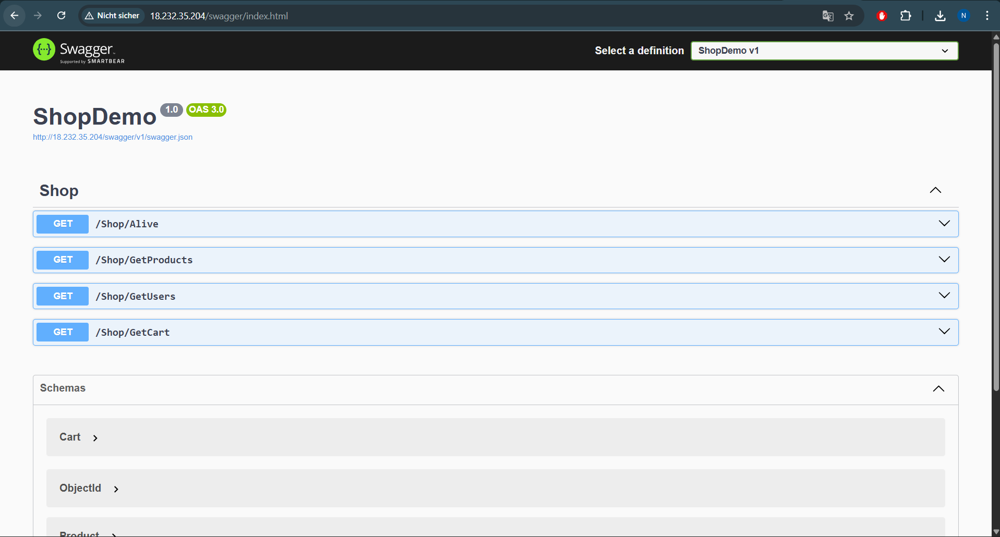

---

## 3. Screenshot von Swagger – Products

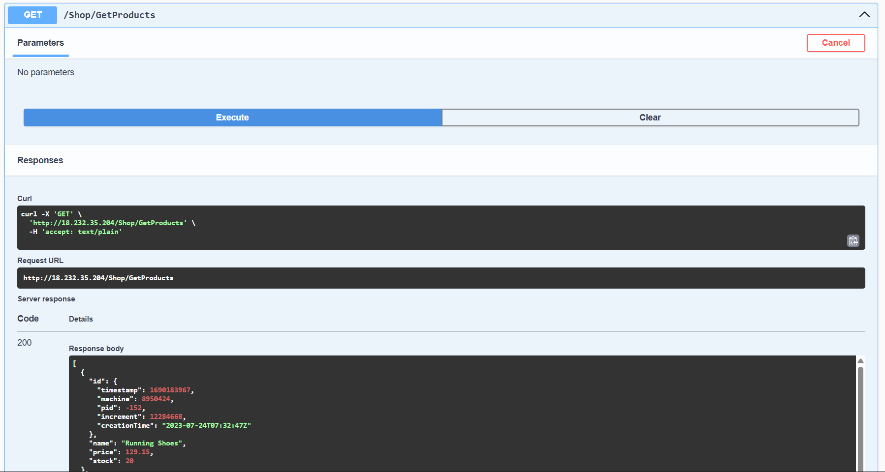

---

## 4. Auszug der Collections in der Datenbank

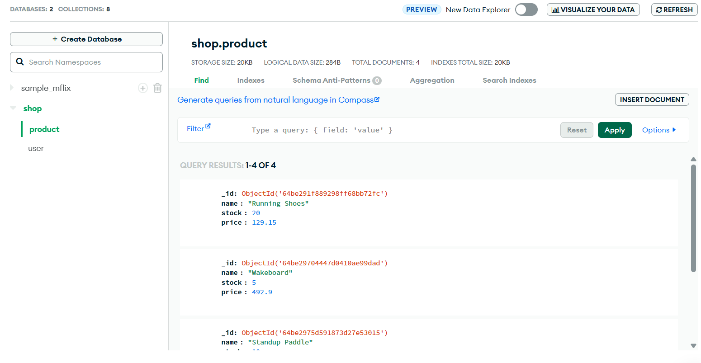

---

## 6. Cloud-init: Was macht keinen Sinn in produktiver Umgebung?

- Passwörter/Secrets im Klartext im Cloud-Init (MongoDB Connection String mit Username/Passwort)
- disable_root: false - Root sollte deaktiviert sein
- SSH-Keys direkt im Script statt über Secrets Manager
- git clone eines öffentlichen Repos - sollte private Registry sein

# B) Vertikale Skalierung (10%)

## Mehr Disk-Space – Dokumentation der Einstellungen

### Screenshots:

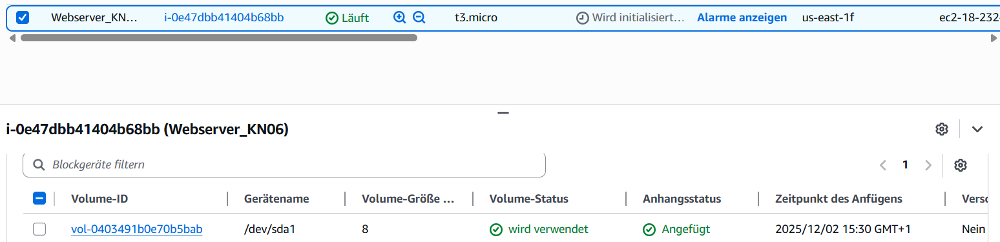
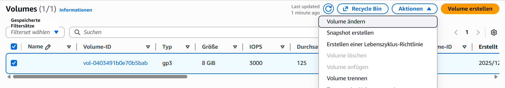

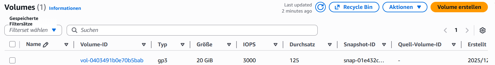
Geht das im laufenden Betrieb?

Ja, das Volume kann erweitert werden während die Instanz läuft
Aber das Dateisystem muss danach noch angepasst werden (mit resize2fs)

---

## Vorher–Nachher (Medium)

### Vorher:

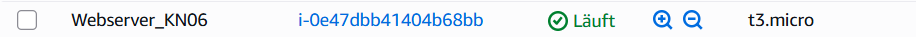

### Wie/Wo:

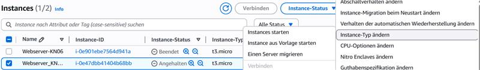
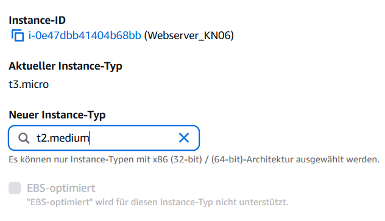

### Nachher:

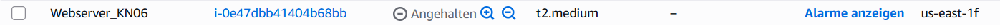

Geht das im laufenden Betrieb?

Nein, die Instanz muss gestoppt werden

# C) Horizontale Skalierung (20%)

Erklärung DNS:

Man erstellt einen CNAME-Eintrag, der `app.tbz-m346.ch` auf die Load Balancer URL `LB-WebAPI-KN06-1491355170.us-east-1.elb.amazonaws.com` weiterleitet.

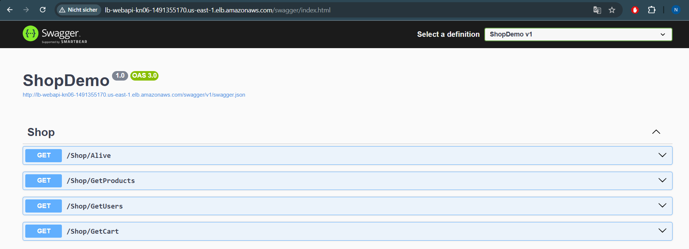

# D) Auto Scaling (20%)

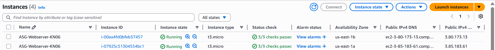
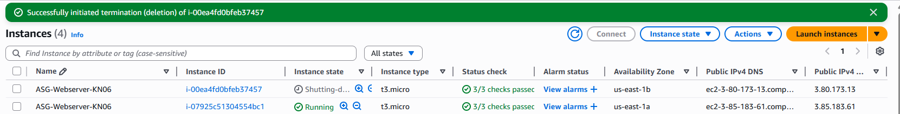
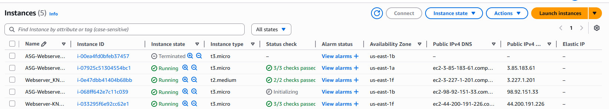
