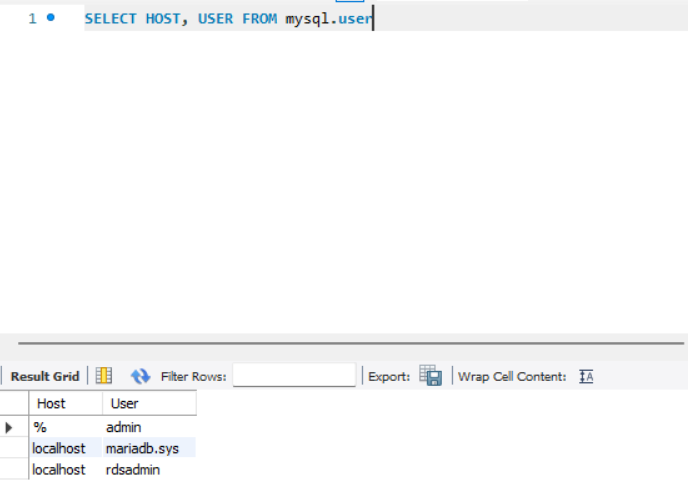
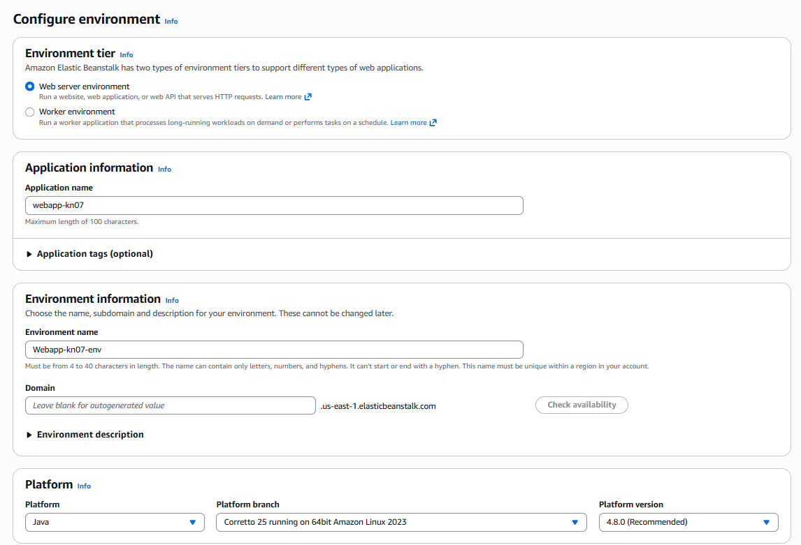
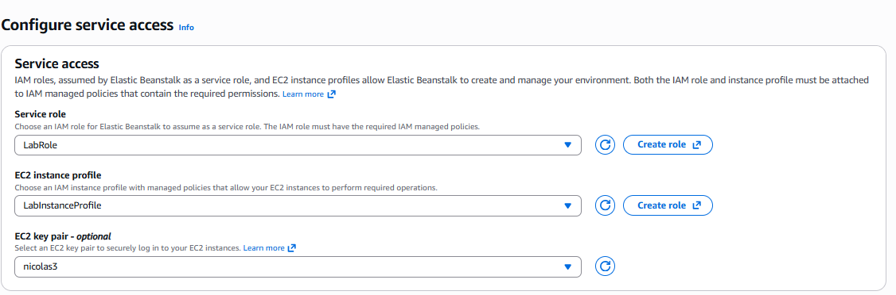
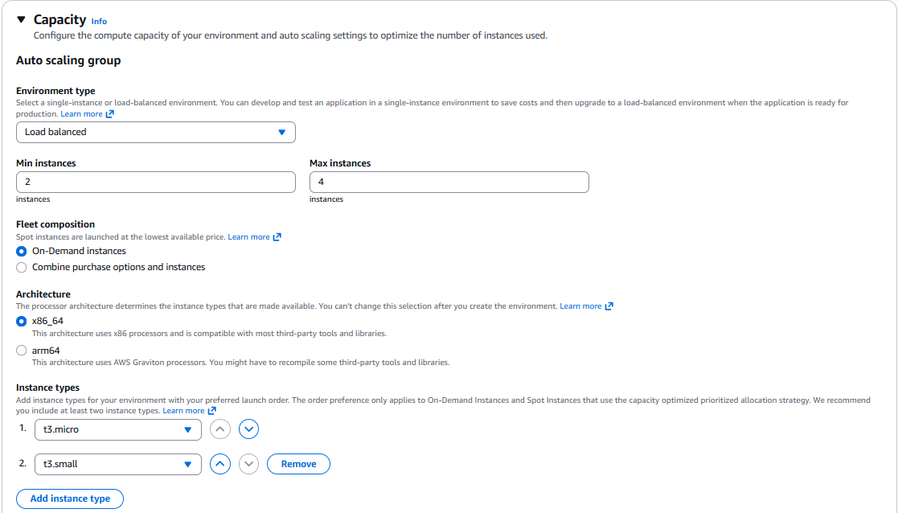
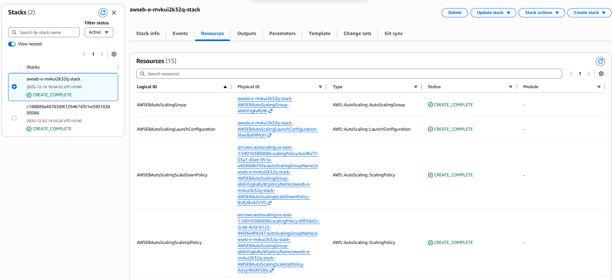

# M346 – Cloud-Lösungen konzipieren und realisieren

## A) Datenbank im PaaS-Modell (20%)

**Warum PaaS/SaaS statt eigener Installation (IaaS)?**

**Verwaltungsaufwand:** Bei PaaS (wie RDS) oder SaaS (wie Atlas) kümmert sich der Anbieter um Updates, Sicherheitspatches und Backups. Bei einer eigenen Installation (IaaS/VM) müsste ich das Betriebssystem und die Datenbank selbst warten.

**Skalierbarkeit:** PaaS-Dienste lassen sich oft per Klick skalieren (mehr Speicher/CPU), während man bei VMs oft manuell migrieren muss.

**Hochverfügbarkeit:** Features wie automatische Backups oder Multi-AZ (Verteilung auf mehrere Rechenzentren) sind bei PaaS oft integriert, bei IaaS muss man sie komplex selbst bauen.

## B) PaaS-Applikation erstellen (60%)

### 1. Applikation konfigurieren

**Erklärung der Auswahl:**

**Plattform:** Java (Corretto) gewählt, da eine Beispiel-Applikation ausgeführt werden soll, um die Infrastruktur zu testen. Mit Python gab es fehler.

**Code:** Sample Application gewählt, um sicherzustellen, dass Deployment-Fehler nicht am Code liegen, sondern an der Infrastruktur.

### 2. Service-Zugriff (Berechtigungen)

**Erklärung der Berechtigungen:**

- **LabRole:** Erlaubnis für Elastic Beanstalk, Aufgaben im Namen des Nutzers auszuführen (z. B. Server starten, Logs speichern, andere AWS-Dienste verwenden).
- **LabInstanceProfile:** Berechtigung für die EC2-Instanzen selbst, z. B. zum Speichern von Logs oder Dateien auf AWS.
- **EC2-Schlüsselpaar:** Standart: nicolas3

---

### 3. Konfigurieren der Kapazität

**Erklärung der Eingestellten Kapazitäten**

**\*Load Balanced:** Ich habe "Load Balanced" statt "Single Instance" gewählt, um Hochverfügbarkeit zu erreichen.

**Instanzen (Min 2 / Max 4):** Mindestens 2 Instanzen sorgen dafür, dass die Anwendung weiterläuft, selbst wenn ein Server abstürzt. Maximal 4 erlauben der Anwendung, bei hoher Last automatisch zu wachsen.

**Instanztypen (t3.micro/small):** Kostengünstige Instanztypen, die für die Testanwendung völlig ausreichen.

## C) Erstellte Ressourcen / Objekte und CloudFormation (20%)

### 1. CloudFormation vs. Cloud-Init

- **CloudFormation:** Automatisches Erstellen der gesamten Infrastruktur (EC2, Load Balancer, Sicherheitsgruppen, Auto-Scaling). Vergleichbar mit einem Bauplan, der AWS genau vorgibt, welche Ressourcen erstellt werden sollen.
- **Cloud-Init:** Führt Konfigurationen auf einzelnen EC2-Instanzen aus (Softwareinstallation, Dateien kopieren, Benutzer anlegen). Erstellt **keine** Infrastruktur.

---

### 2. Erstellte Instanzen

---

### 3. CloudFormation Stacks und Ressourcen

#### Stacks & Ressourcen

**Vergleich zu KN06:** In KN06 mussten wir den Webserver (Nginx/Apache) manuell per Befehl oder Skript installieren. Hier hat Elastic Beanstalk (via CloudFormation) die komplette Umgebung inkl. Load Balancer, Auto Scaling Group und Sicherheitsgruppen vollautomatisch erstellt. Wir mussten uns nicht um die Installation der Software auf dem Server kümmern.
