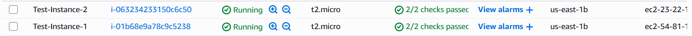
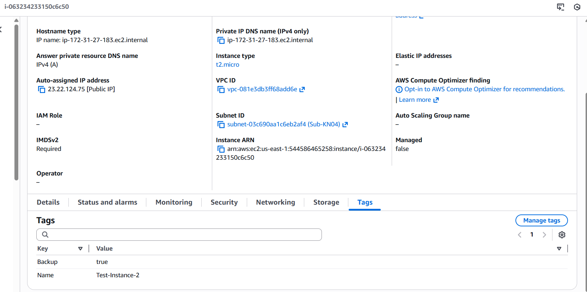
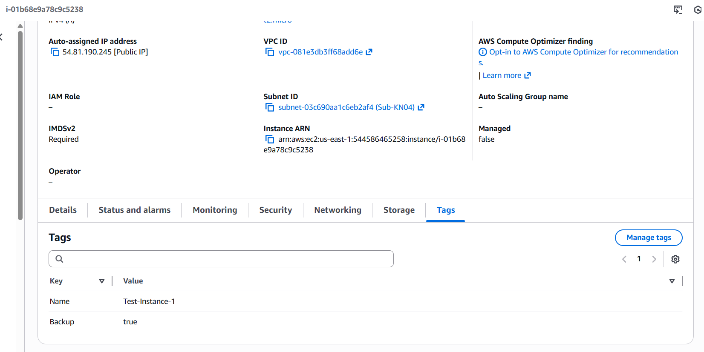
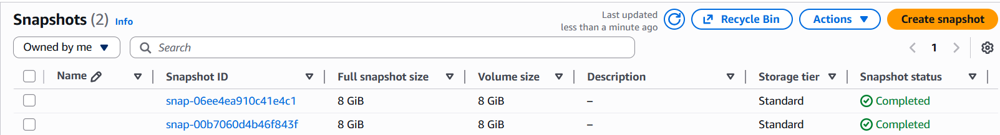
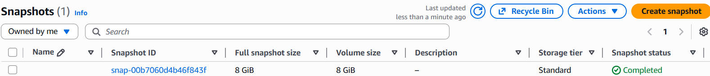

## A) Backup-Skript (70%)

### 1. EC2 Instanzen mit Backup-Tag

---

### 2. Lambda Backup-Funktion erstellen

**Funktion:** backup-ec2-instances

Die Lambda-Funktion sucht alle EC2 Instanzen mit dem Tag "Backup" und erstellt automatisch Snapshots der zugehörigen EBS-Volumes.

**Code:** backup.py (Python 3.14)

**Funktionsweise:**

- Sucht nach Instanzen mit Tag "Backup"
- Erstellt Snapshots aller EBS-Volumes
- Fügt Tag "DeleteOn" mit Datum (7 Tage in Zukunft) hinzu
- Retention-Periode: 7 Tage (Standard)

Rolle: Labrole (wegen Berechtigungen)

**Timeout:** 1 Minute

---

### 3. Snapshots nach Backup

Nach der Ausführung der Backup-Lambda wurden 2 Snapshots erfolgreich erstellt:

---

### 4. Snapshot Tags

Jeder Snapshot erhält automatisch den Tag "DeleteOn" mit einem Datum 7 Tage in der Zukunft. Dies wird vom Cleanup-Skript verwendet um alte Backups zu löschen.

---

### 5. Lambda Cleanup-Funktion erstellen

**Funktion:** cleanup-ec2-snapshots

Die Lambda-Funktion löscht automatisch Snapshots deren "DeleteOn" Datum erreicht oder überschritten ist.

**Code:** cleanup.py (Python 3.14)

**Funktionsweise:**

- Sucht nach Snapshots mit Tag "DeleteOn"
- Vergleicht das Datum mit dem heutigen Datum
- Löscht Snapshots wenn DeleteOn = heute

**Test:** Ich habe das DeleteOn-Datum eines Snapshots auf heute gesetzt, um die Cleanup-Funktion zu testen.

---

### 6. Snapshots nach Cleanup

Nach der Ausführung der Cleanup-Lambda wurde der Snapshot mit heutigem DeleteOn-Datum erfolgreich gelöscht:

---

## B) CRON-Job (30%)

### Automatisierung mit EventBridge Scheduler

Um die Backup- und Cleanup-Funktionen automatisch auszuführen, habe ich zwei EventBridge Schedules erstellt:

#### 1. Daily Backup Schedule

- **Name:** daily-backup
- **Typ:** Rate-based schedule
- **Rate:** 1 Day (täglich)
- **Target:** Lambda-Funktion backup-ec2-instances
- **Execution Role:** LabRole

Diese Schedule führt jeden Tag automatisch ein Backup aller Instanzen mit "Backup"-Tag durch.

---

#### 2. Daily Cleanup Schedule

- **Name:** daily-cleanup
- **Typ:** Rate-based schedule
- **Rate:** 1 Day (täglich)
- **Target:** Lambda-Funktion cleanup-ec2-snapshots
- **Execution Role:** LabRole

Diese Schedule prüft jeden Tag ob Snapshots mit abgelaufenem DeleteOn-Datum vorhanden sind und löscht diese automatisch.

---

## Zusammenfassung

Ich habe erfolgreich ein automatisches Backup-System für EC2 Instanzen implementiert:

- **Serverless Functions (Lambda):** Zwei Python-Funktionen für Backup und Cleanup
- **Automatisierung:** EventBridge Schedules für tägliche Ausführung
- **Tag-basierte Verwaltung:** Instanzen mit "Backup"-Tag werden automatisch gesichert
- **Automatisches Cleanup:** Snapshots älter als 7 Tage werden automatisch gelöscht
- **Keine Server-Wartung:** Komplett serverless, keine EC2-Instanzen nötig

Das System läuft vollständig automatisch und benötigt keine manuelle Intervention.
