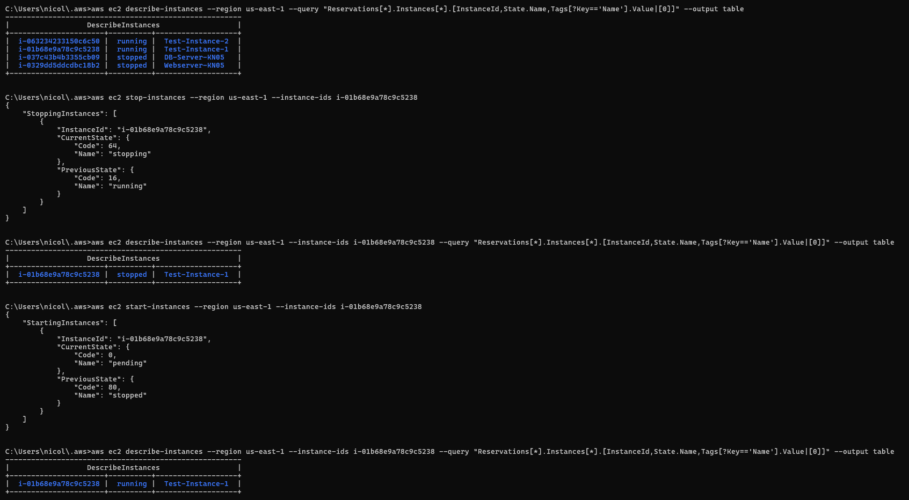
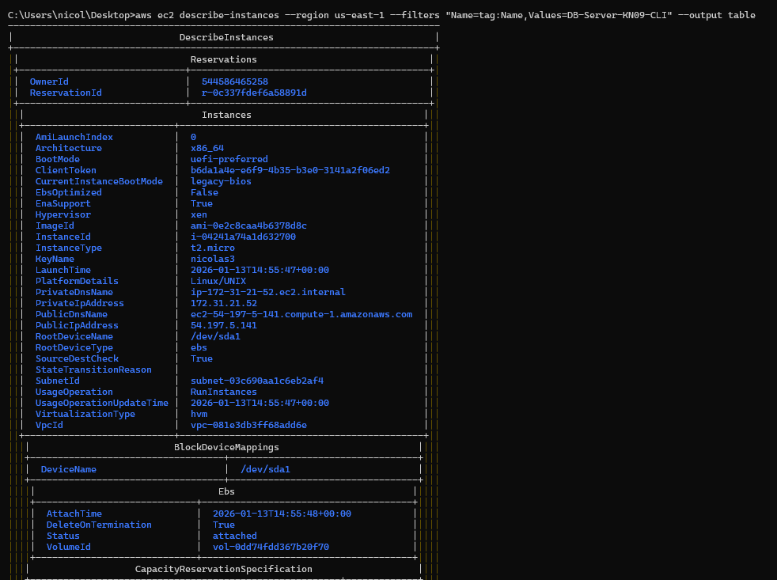
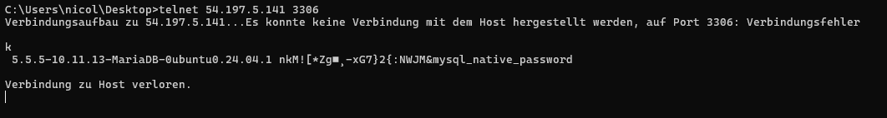
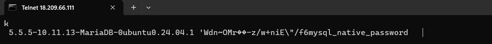

## A) Automatisierung mit Command Line Interface (CLI) (30%)

### A1: Screenshot der Instanz die gestoppt und gestartet wurde



**Durchgeführte Aktionen:**

- Instanz `Test-Instance-1` (i-01b68e9a78c9c5238) wurde gestoppt
- Status wechselte von `running` → `stopping` → `stopped`
- Instanz wurde wieder gestartet
- Status wechselte von `stopped` → `pending` → `running`

---

### A2: CLI-Befehle als Skript

```bash
# KN09 - CLI Befehle

# Instanz stoppen
aws ec2 stop-instances --region us-east-1 --instance-ids i-01b68e9a78c9c5238

# Status prüfen
aws ec2 describe-instances --region us-east-1 --instance-ids i-01b68e9a78c9c5238 --query "Reservations[*].Instances[*].[InstanceId,State.Name,Tags[?Key=='Name'].Value|[0]]" --output table

# Instanz starten
aws ec2 start-instances --region us-east-1 --instance-ids i-01b68e9a78c9c5238

# Neue DB-Instanz erstellen mit Cloud-Init
aws ec2 run-instances --region us-east-1 --image-id ami-0e2c8caa4b6378d8c --instance-type t2.micro --key-name nicolas3 --security-group-ids sg-034b94d70eb5a47a2 --user-data file://db-cloud-init.yaml --tag-specifications "ResourceType=instance,Tags=[{Key=Name,Value=DB-Server-KN09-CLI}]"

# Security Group Port 3306 öffnen (falls notwendig)
aws ec2 authorize-security-group-ingress --region us-east-1 --group-id sg-034b94d70eb5a47a2 --protocol tcp --port 3306 --cidr 0.0.0.0/0
```

---

### A3: Screenshot der neu erstellten Instanz



**Instanz-Details:**

- Name: DB-Server-KN09-CLI
- Instance ID: i-04241a74a1d632700
- Public IP: 54.197.5.141
- Instance Type: t2.micro
- AMI: ami-0e2c8caa4b6378d8c (Ubuntu)

---

### A4: Screenshot Telnet-Befehl (Cloud-Init funktioniert)



```
telnet 54.197.5.141 3306
```

**Ergebnis:** MariaDB antwortet mit Version `5.5.5-10.11.13-MariaDB-0ubuntu0.24.04.1` - das Cloud-Init Skript wurde erfolgreich ausgeführt.

---

### A5: Konzeptionelle Befehle für KN05

```bash
# KN05 - Konzeptionelle CLI Befehle
# (Referenzen sind Beispiele, werden nicht ausgeführt)

# 1. Security Group für Webserver erstellen
aws ec2 create-security-group --group-name SG-Webserver-KN05-CLI --description "Security Group fuer Webserver" --vpc-id vpc-081e3db3ff68add6e

# 2. Security Group Regeln für Webserver (SSH + HTTP)
aws ec2 authorize-security-group-ingress --group-id sg-WEBSERVER-EXAMPLE --protocol tcp --port 22 --cidr 0.0.0.0/0
aws ec2 authorize-security-group-ingress --group-id sg-WEBSERVER-EXAMPLE --protocol tcp --port 80 --cidr 0.0.0.0/0

# 3. Security Group für Datenbank erstellen
aws ec2 create-security-group --group-name SG-Database-KN05-CLI --description "Security Group fuer Datenbank" --vpc-id vpc-081e3db3ff68add6e

# 4. Security Group Regeln für Datenbank (SSH + MySQL)
aws ec2 authorize-security-group-ingress --group-id sg-DATABASE-EXAMPLE --protocol tcp --port 22 --cidr 0.0.0.0/0
aws ec2 authorize-security-group-ingress --group-id sg-DATABASE-EXAMPLE --protocol tcp --port 3306 --cidr 0.0.0.0/0

# 5. Elastic IP erstellen
aws ec2 allocate-address --domain vpc --tag-specifications "ResourceType=elastic-ip,Tags=[{Key=Name,Value=EIP-Webserver-KN05-CLI}]"

# 6. DB-Server Instanz erstellen
aws ec2 run-instances --image-id ami-0e2c8caa4b6378d8c --instance-type t2.micro --key-name nicolas3 --security-group-ids sg-DATABASE-EXAMPLE --private-ip-address 172.31.48.20 --user-data file://db-cloud-init.yaml --tag-specifications "ResourceType=instance,Tags=[{Key=Name,Value=DB-Server-KN05-CLI}]"

# 7. Webserver Instanz erstellen
aws ec2 run-instances --image-id ami-0e2c8caa4b6378d8c --instance-type t2.micro --key-name nicolas3 --security-group-ids sg-WEBSERVER-EXAMPLE --private-ip-address 172.31.48.10 --user-data file://web-cloud-init.yaml --tag-specifications "ResourceType=instance,Tags=[{Key=Name,Value=Webserver-KN05-CLI}]"

# 8. Elastic IP dem Webserver zuweisen
aws ec2 associate-address --instance-id i-WEBSERVER-EXAMPLE --allocation-id eipalloc-EXAMPLE
```

---

### A6: Überlegungen zur Automatisierung

**Was ist notwendig für die Automatisierung?**

Die CLI-Befehle können nicht einfach nacheinander in einem Skript ausgeführt werden, weil sie voneinander abhängen:

1. **Abhängigkeiten verwalten:** Die Security Group muss erst erstellt werden, bevor ihre ID bei der Instanz-Erstellung verwendet werden kann. Die Instanz muss laufen, bevor eine Elastic IP zugewiesen werden kann.

2. **Ausgaben parsen:** Jeder Befehl gibt eine ID zurück (z.B. Security Group ID, Instance ID). Diese muss aus der JSON-Ausgabe extrahiert und in Variablen gespeichert werden.

3. **Warten auf Ressourcen:** Eine Instanz ist nicht sofort im Status "running" nach der Erstellung. Man muss warten (z.B. mit `aws ec2 wait instance-running`) bis die Ressource bereit ist.

4. **Fehlerbehandlung:** Was passiert wenn ein Befehl fehlschlägt? Sollen bereits erstellte Ressourcen wieder gelöscht werden?

**Wie geht man vor?**

Für eine echte Automatisierung müsste man ein Bash- oder PowerShell-Skript schreiben mit:

- Variablen zum Speichern von IDs
- `--query` und `--output text` zum Parsen der Ausgaben
- Wait-Befehlen für Synchronisation
- If-Bedingungen für Fehlerbehandlung

Beispiel:

```bash
SG_ID=$(aws ec2 create-security-group --group-name SG-Test --description "Test" --query 'GroupId' --output text)
aws ec2 run-instances --security-group-ids $SG_ID ...
```

---

## B) Terraform (70%)

### B1: Terraform Konfiguration

Die Terraform-Konfigurationsdatei `main.tf` befindet sich als separate Datei im Repository.

---

### B2: Screenshot Telnet-Befehl (Terraform-Instanz)



```
telnet 18.209.66.111 3306
```

**Ergebnis:** MariaDB antwortet - die Terraform-Konfiguration mit User-Data funktioniert.

---

### B3: Konsolen-Befehle (Terraform CLI)

```bash
# In den Projektordner wechseln
cd terraform-kn09

# Terraform initialisieren (Provider herunterladen)
terraform init

# Vorschau der Änderungen anzeigen
terraform plan

# Infrastruktur erstellen
terraform apply
# Bei der Frage "Do you want to perform these actions?" mit "yes" bestätigen
```

**Ausgabe von terraform apply:**

```
Apply complete! Resources: 2 added, 0 changed, 0 destroyed.

Outputs:

db_server_public_ip = "3.84.128.46"
```

---

### B4: Warum ist bei Terraform keine manuelle Abhängigkeitsverwaltung notwendig?

Bei der CLI-Automatisierung musste man selbst:

- IDs parsen und in Variablen speichern
- Die richtige Reihenfolge einhalten
- Auf Ressourcen warten
- Fehler behandeln

**Bei Terraform ist das alles nicht notwendig, weil:**

1. **Automatische Abhängigkeitserkennung:** Terraform analysiert den Code und erkennt Abhängigkeiten automatisch. Wenn ich `aws_security_group.db_sg.id` in der Instanz-Konfiguration verwende, weiss Terraform, dass die Security Group zuerst erstellt werden muss.

2. **Dependency Graph:** Terraform erstellt einen Graphen aller Ressourcen und ihrer Abhängigkeiten. Ressourcen werden automatisch in der richtigen Reihenfolge erstellt.

3. **Automatisches Warten:** Terraform wartet automatisch, bis eine Ressource vollständig erstellt ist, bevor abhängige Ressourcen erstellt werden.

4. **Deklarativer Ansatz:** Man beschreibt den gewünschten Zustand, nicht die einzelnen Schritte. Terraform ermittelt selbst, was zu tun ist.

5. **State Management:** Terraform speichert den aktuellen Zustand und kann bei Fehlern oder Änderungen gezielt nur die notwendigen Anpassungen vornehmen.

6. **Eingebaute Fehlerbehandlung:** Bei Fehlern zeigt Terraform genau an, was schiefgelaufen ist, und der Zustand bleibt konsistent.

**Fazit:** Terraform abstrahiert die Komplexität der Abhängigkeitsverwaltung und macht Infrastructure as Code deutlich einfacher und zuverlässiger als reine CLI-Skripte.
