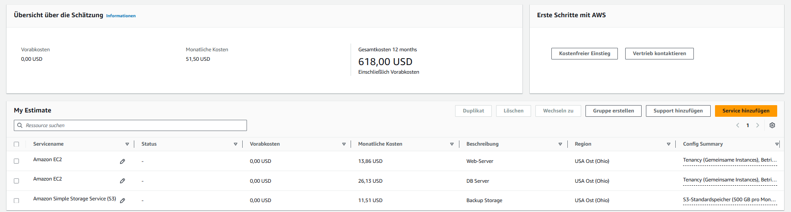
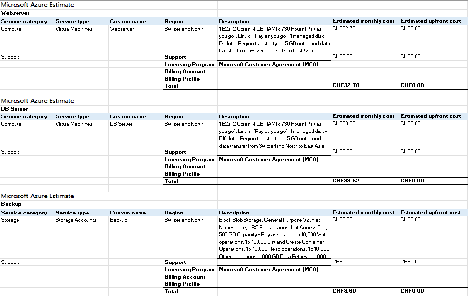
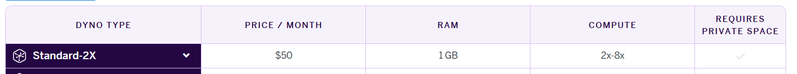
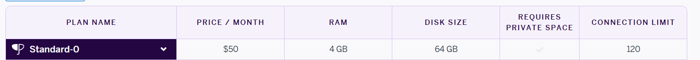
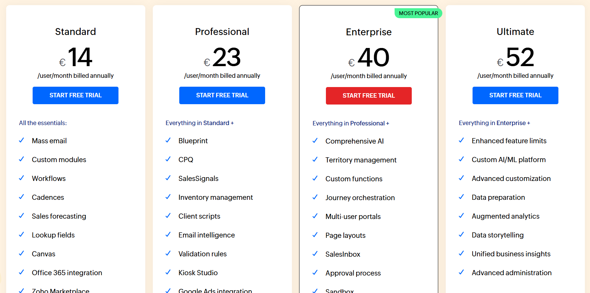
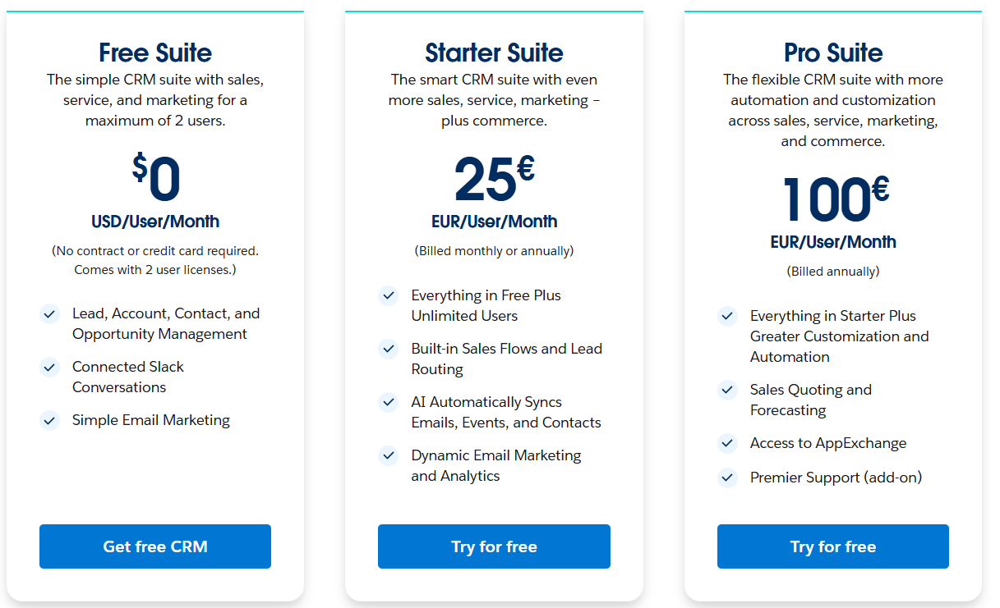
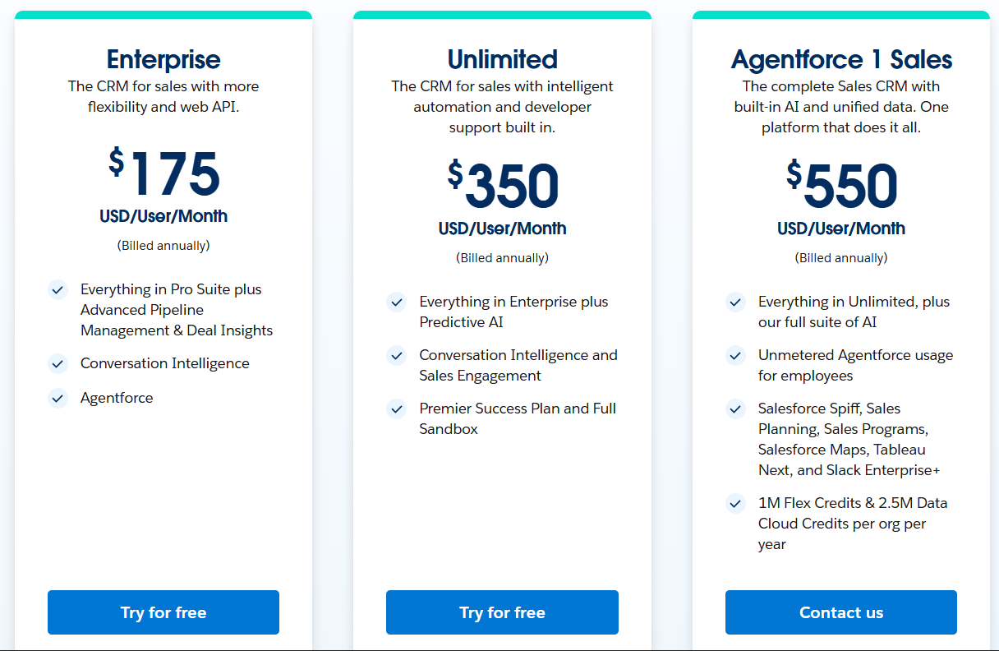

# IAAS - Rehosting (60%)

## AWS Kostenrechner - Übersicht

### Webserver

- **Instanz:** t4g.small
- **Specs:** 2 vCPU, 2 GB RAM, 5 Gbit/s Netzwerkleistung
- **Begründung:** Entspricht der bisherigen On-Premise-Leistung, ausreichend für 30–40 Benutzer und kostengünstig.

### Datenbank

- **Instanz:** t4g.medium
- **Specs:** 2 vCPU, 4 GB RAM, 5 Gbit/s Netzwerkleistung
- **Begründung:** Mehr RAM für höhere Datenbank-Last, entspricht den On-Premise-Anforderungen.

### Backup

- **Speicher:** S3 Standard, 500 GB
- **Begründung:** Deckt tägliche, wöchentliche und monatliche Backups ab.

### Generelle Zahlung:

- **Option:** On-Demand
- **Begründung:** Flexibel, keine langfristige Bindung erforderlich. (+ Einfacher zum Erklären)

### Abweichungen zur On-Premise Infrastruktur:

- **Web Server:** On-Premise hatte 1 Core, AWS t4g.small hat 2 vCPUs. Es gibt keine 1-vCPU-Instanz mit 2 GB RAM, daher nächstgrössere Variante gewählt.
- **DB Server:** Entspricht 1:1 den Anforderungen (2 vCPU, 4 GB RAM, 100 GB Storage).
- **Backup:** On-Premise Backup-Lösung unbekannt. S3 bietet flexible, skalierbare Speicherung.

---

## Azure Kostenrechner - Übersicht

### Webserver

- **Instanz:** B2s / Standard-B2s VM
- **Specs:** 2 vCPU, 4 GB RAM, 32 GB SSD (E4)
- **Begründung:** On-Premise hatte 1 Core und 2 GB RAM. Azure bietet keine passende kleinere Instanz in der B-Serie, daher wurde die nächstgrössere gewählt.

### Datenbank

- **Instanz:** B2s / Standard-B2s VM
- **Specs:** 2 vCPU, 4 GB RAM, 128 GB SSD (E10)
- **Begründung:** Entspricht 1:1 den On-Premise-Anforderungen (2 Cores, 4 GB RAM, 100 GB Speicher).

### Backup

- **Lösung:** Azure Blob Storage (Block Blob, Standard, LRS)
- **Kapazität:** 500 GB
- **Begründung:** Günstige Speicherlösung für Datenbank-Backups. Deckt tägliche, wöchentliche und monatliche Backups ab.

---

# PAAS - Replatforming (20%)

## Webserver (Heroku Dynos)

- **Dyno Type:** Standard-2X
- **Preis / Monat:** $50
- **Specs:** 1 GB RAM, 2 vCPU
- **Begründung:** Geeignet für 30 Benutzer und kleine bis mittelgrosse Apps; RAM kleiner als On-Premise, reicht aber für Standardbetrieb; kostengünstig und flexibel.

## Datenbank (Heroku Postgres)

- **Plan Name:** Standard-0
- **Preis / Monat:** $50
- **Specs:** 4 GB RAM, 64 GB Disk Size, 120 Connections
- **Begründung:** Entspricht On-Premise-Datenbank (4 GB RAM). Disk Size ist mit 64 GB etwas kleiner als On-Premise (100 GB), reicht aber für den Anfang. Backups sind automatisch inklusive.

## Backup und Speicher

Heroku Managed Postgres übernimmt Backups automatisch, kein separates Backup-Dyno nötig.

---

# Kostenrechnung SAAS – Repurchasing (10%)

## Anbieter & Screenshots

### Zoho CRM

### Salesforce Sales Cloud

## Auswahl des Pricings

**Zoho CRM:**  
Professional (€23/User/Monat)
Weil: Professional bietet zusätzliche Features wie Blueprint, SalesSignals und Inventory Management welche nützlich für ein etabliertes CRM sind.

**Salesforce Sales Cloud:**  
Empfehlung: Starter Suite (€25/User/Monat)
Begründung: Free Suite unterstützt nur 2 User. Starter Suite bietet alle wichtigen CRM-Funktionen (Sales Flows, Lead Routing, Email Marketing) zu einem vernünftigen Preis.

---

## Entscheidung

Zoho ist günstiger und bietet ähnliche Funktionen.

---

# Interpretation der Resultate (10%)

## Kostenvergleich

- **AWS & Azure (IaaS):** Kosten für Instanzen, Storage, Backup und Daten-Transfer. Unterschiede durch unterschiedliche Preise für Hardware und Netzwerk. Zusätzliche Kosten: Software-Lizenzen, Support.
- **Heroku (PaaS):** Höhere Kosten, da Plattform-Management übernommen wird. Vorteil: weniger eigener Aufwand.
- **Zoho & Salesforce (SaaS):** Abonnement pro Benutzer. Salesforce teurer, Zoho günstiger bei ähnlichen Funktionen. Zusätzliche Kosten: Integrationen oder Apps.

**Fazit Kosten:** IaaS günstig für kleine Teams, PaaS teurer aber einfacher, SaaS einfach zu nutzen mit kalkulierbaren Kosten.

## Aufwand für die Firma

- **IaaS:** Server einrichten, Updates, Backups, Sicherheit, Monitoring.
- **PaaS:** Anwendung deployen, Infrastruktur übernimmt Anbieter.
- **SaaS:** Benutzer einrichten, Workflows konfigurieren, Daten migrieren.

**Fazit Aufwand:** IaaS → hoher Aufwand, volle Kontrolle; PaaS → mittlerer Aufwand; SaaS → minimaler Aufwand, einfache Nutzung.
